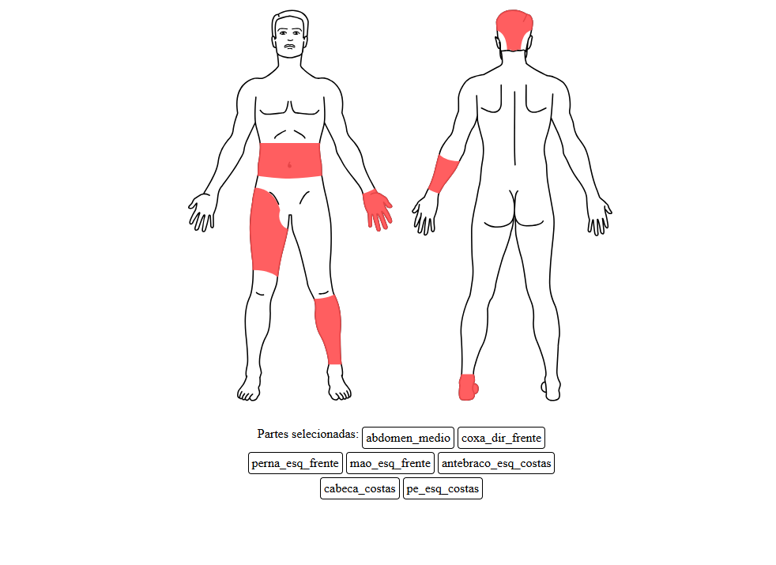

# react-js-human-body-parts

Aplicação web interativa desenvolvida com React e TypeScript para visualização e seleção de partes do corpo humano.

> **Baseado em:** [darshan260802/human-body-react](https://github.com/darshan260802/human-body-react)

## Visão Geral

O **react-js-human-body-parts** permite a seleção de partes do corpo em aplicações médicas. O objetivo inicial por trás do projeto é permitir que o usuário selecione partes do corpo que sofreram lesões em um acidente, por exemplo. A interface facilita a identificação visual e a marcação das regiões afetadas, tornando o componente útil em aplicações hospitalares e clínicas.

## Funcionalidades Principais

- **Visualização Interativa:** Explore partes do corpo humano em uma interface moderna e responsiva.
- **Slugs Únicos para Identificação:** Cada parte do corpo é identificada internamente por um _slug_ único (exemplo: `pe_dir_frente`, `perna_esq_costas`), facilitando a manipulação via código. Os _slugs_ podem ser customizados conforme a necessidade.

## Como Funciona a Customização

O sistema utiliza _slugs_ (identificadores únicos, como `pe_dir_frente`, `perna_esq_costas`, `genital`, etc.) para mapear cada parte do corpo. Os slugs são definidos em `./types/slug.ts`.
O tipo `BodyPart` define o _slug_ e o `path` svg da parte do corpo.
Cada `<path>` que compõe as partes do corpo é atribuída a um _Slug_ através dos arquivos bodyFront.ts e bodyBack.ts

**`slug.ts`**
```ts
export type Slug = 
"pe_esq_frente" | "pe_dir_frente" |
"perna_esq_frente" | "perna_dir_frente" |
"joelho_esq_frente" | "joelho_dir_frente" |
```

**`bodyPart.ts`**
```ts
export interface BodyPart {
    path?: string;
    slug: Slug;
}
```

**`bodyFront.ts`**
```ts
export const backBody: BodyPart[] = [
    {
        slug: "pe_esq_costas",
        path: "m ..."
    },
    {
        slug: "pe_dir_costas",
        path: "m ..."
    },
```

**Exemplo de uso:**
```tsx
import { useCallback, useState } from 'react';
import './App.css'
import { Body } from './components/body/Body'
import type { Slug } from './components/body/types/slug';

function App() {
  const [selectedParts, setSelectedParts] = useState<Slug[]>([]);

  const handlePartClick = useCallback((part: Slug) => {
    setSelectedParts((prevSelectedParts) => {
      if (prevSelectedParts.includes(part)) {
        return prevSelectedParts.filter((p) => p !== part);
      } else {
        return [...prevSelectedParts, part];
      }
    });
  }, []);

  const scale = 1.3;
  return (
    <div style={{ display: "flex", flexDirection: "column", alignItems: "center", gap: "20px" }}>
      <div style={{ display: "flex", flexWrap: "wrap", justifyContent: "center", gap: "20px" }}>
        <Body side='front' selectedParts={selectedParts} scale={scale} onPartClick={handlePartClick} />
        <Body side='back' selectedParts={selectedParts} scale={scale} onPartClick={handlePartClick} />
      </div>
      <div style={{ display: "flex", flexWrap: "wrap", justifyContent: "center", gap: "4px", maxWidth: "400px" }}>
        <span>
          Partes selecionadas:
        </span>
        {selectedParts.map((part) => (
          <span key={part} style={{ padding: "4px", border: "1px solid black", borderRadius: "4px" }}>
            {part}
          </span>
        ))}
      </div>
    </div>
  )
}

export default App
```



## Instalação

```bash
git clone https://github.com/Gilthayllor/react-js-human-body-parts.git
cd react-js-human-body-parts
npm install
# ou
yarn install
```

## Execução
```bash
npm run dev
```
A aplicação será iniciada em http://localhost:5173

## Créditos

Esta aplicação foi baseada e inspirada no projeto [darshan260802/human-body-react](https://github.com/darshan260802/human-body-react).

## Contribuição

Contribuições são bem-vindas! Sinta-se à vontade para abrir issues, sugerir melhorias ou enviar pull requests.

## Licença

Este projeto está sob a licença MIT. Veja o arquivo [LICENSE](LICENSE) para mais detalhes.

---

_Feito com ❤️ por [Gilthayllor](https://github.com/Gilthayllor)_
